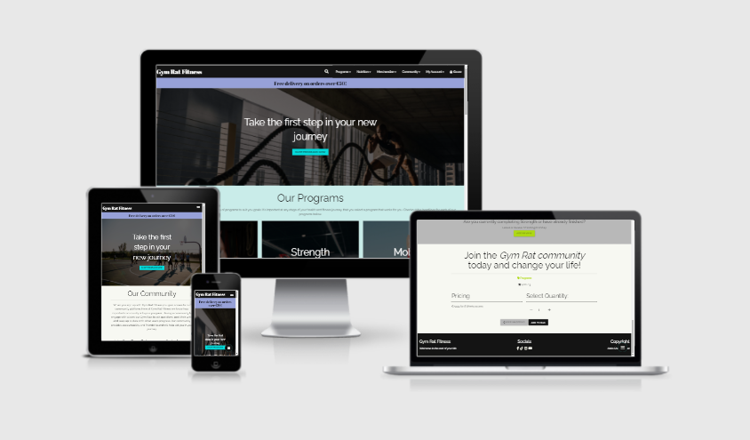
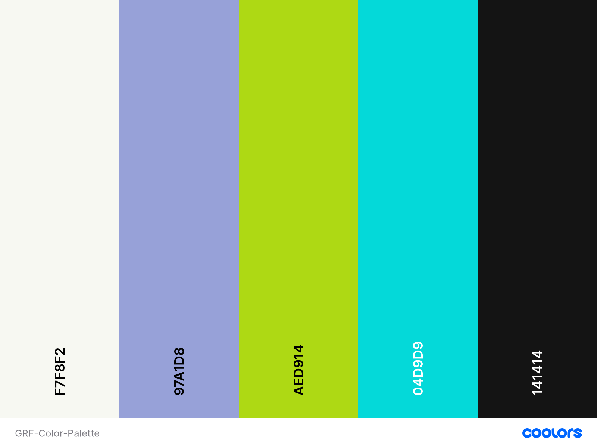

# Gym Rat Fitness
#### ***Welcome to the rest of your life!***
Beginning your fitness journey can be an overwhelming experience and it can be difficult to know where or how to begin. From figuring out how to build and structure your workouts, to developing the right nutrition plan for your goals, it’s easy to get stressed or disheartened by the journey ahead. That’s where ***Gym Rat Fitness*** steps in to help! We deliver an all-inclusive app experience for people at every stage of their fitness journey, providing detailed workout programs and nutrition plans tailored to your specific goals.

# Demo
Visit the live site [here](https://gym-rat-fitness.herokuapp.com/)


# Contents:
* [UX](#UX)
	* [User Stories](#user-stories) 
	* [Strategies](#strategies)
	* [Scope](#scope)
	* [Structure](#structure)
	* [Skeleton](#skeleton)
	* [Surface](#surface)
* [Features](#features)
	* [Existing features](#existing-features)
	* [Features left to implement](#features-left-to-implement)
* [Technologies Used](#technologies-used)
	* [Languages](#languages)
	* [Frameworks, packages, libraries and toolkits](#frameworks,-packages,-libraries-and-toolkits)
* [Database](#database)
	* [Schema](#schema)
* [Testing](#testing)
* [Deployment](#deployment)
	* [Git](#git) 
	* [GitHub](#github)
	* [Heroku](#heroku)
	* [AWS](#aws)
	* [Email](#email)
* [Credits](#credits)
	* [Code](#code)
	* [Content](#content)
	* [Media](#media)
	* [Acknowledgements](#acknowledgements)

# UX 
## User Stories
***As a casual unregistered user, I want to be able to:***
* Navigate across the site easily
* Quickly identify any new programs or deals
* Browse the available programs and nutrition plans
* Search for a particular program I’ve heard about
* View my bag and the items added to it
* Add an item to my bag
* Edit the quantity of items from my bag
* Delete or remove an item from my bag
* Make a purchase securely without creating an account
* Have the option to create an account if I like the content of the site

***As a returning user, I want to be able to:***
* Easily login to my account
* Easily logout of my account
* Post updates of my progress
* Update one of my posts
* Delete one of my posts
* View other users posts
* View all users posts
* Post a review of a product 
* Edit my review of a product
* Delete one of my reviews
* Easily purchase a program, nutrition plan, or merchandise
* Save and/or update my shipping address
* View my order history 
* Add profile information 
* Edit profile information

***As the site owner or admin, I want to be able to:***
* Login to the administration panel
* Add a new program or nutrition plan to the site without logging into the admin panel
* Edit/update any program or nutrition plan on the site without logging into the admin panel
* Delete any program or nutrition plan on the site without logging into the admin panel

## Strategies

### Purpose & Objectives
* The purpose of this site is to provide a well-structured fitness subscription application where users can purchase a variety of exercise programs, nutritional plans and merchandise. Gym Rat Fitness is a community driven app and provides a 'Community' platform for all registered users to engage with other users to follow each others progress, make new Gym Rat friends, ask questions, and to keep each other accountable. GDF offers a variety of programs catering to all levels of fitness, we've also got nutrition in the bag as well! Each program comes with a built-in nutritional guide to take the hassle out of creating your own meal guides, with thousands of meals to choose from built into the app.

* The objective of this site is to provide the framework necessary for users to purchase exercise programs, nutrition plans, and merchandise securely using Stripe to process card payments.  As a means of encouraging and maintaining user engagement and interaction, a community platform has been established for users to interact with one another. The ability to add a review of any product has also been implemented to encourage further purchasing and to gain user feedback for the products for sale. Django and Materialize were utilized to build the project and provides a user-friendly front-end for users to interact with. 

### Owner Goals
* To build an active community based around Gym Rat Fitness exercise programs, nutrition plans and merchandise.
* To build and encourage a community atmosphere through user engagement through the My Community platform.
* Allow for product reviews to increase user interaction and engagement and to gain insight into user satisfaction in relation to the products. 
 
## Scope
 The functional requirements put in place help aid the user to access the content they are looking for quickly and easily, guide them through the payment and purchasing process smoothly, and encourage further user engagement with the site. The functional requirements provide the framework for users to:
 * Create an account
 * Log in/out
 * Purchase Gym Rat Fitness exercise programs, nutrition plans and merchandise securely
 * Review products
 * Perform CRUD operations on their own profile information, reviews, posts and comments
 * Interact and engage with other users 
 
User feedback is provided throughout the site to aid user actions. This is all combined to present a user-friendly, intuitive, front-end design to maximise UX:
* Django
* Python
* Stripe

 The required content for the site is:
 * Product/item information
 * Media files for Gym Rat Fitness exercise programs, nutrition plans and merchandise.
 * User feedback in the form of toasts
 
## Structure
 * The site is designed to foster intuitive learning; the aim is to provide an intuitive interaction between the user and the website.
 * Content is structured logically and grouped categorically.
 * Users can quickly identify and access the information they are looking for.
 
## Skeleton
 **Wireframes:**
Wireframes were created for each HTML file across a variety of viewports (mobile, tablet/iPad, laptop/desktop). The site evolved beyond on the wireframes quite a bit during developement.
The wireframes for each can be viewed here:

[Home](Documents/wireframes/Home_Landing_pg.png)

[Programs](Documents/wireframes/Programs.png)

[Program Details](Documents/wireframes/Program_details.png)

[Nutrition](Documents/wireframes/Nutrition.png)

[Nutrition Details](Documents/wireframes/Nutrition_details.png)

[My Community](Documents/wireframes/My_Community.png)

[Profile](Documents/wireframes/My_Profile.png)

[Checkout](Documents/wireframes/Checkout.png)

[Merchandise](Documents/wireframes/Merch.png)

[Merchandise Details](Documents/wireframes/Merch_details.png)

[Login](Documents/wireframes/Login.png)

[Sign Up](Documents/wireframes/Register.png)

## Surface
 **Aesthetic:** As the app is orientated towards a fitness demographic, I wanted to keep the feel of the site modern, clean and bright with pops of accent colours.
  
 **Colour Palette:** I chose to use 5 colours throughout the site, 2 base colours and 3 accent colours.
 

**Typography:**

**Images:** The images chosen are all fitness orientated and intuitively provide further context to the purpose of the site. 


# Features
## Existing features
**Navigation Bar:**
The navigation bar is available in the default position and allows users to quickly identify the different sections of the site. On mobile and table viewports, these sections are available in a collapsible menu to provide a cleaner layout on smaller screens. The sections presented on the nav-bar change depending on the following: 
1. Whether the user is logged in.
2. Whether the user logged in is actually a site admin.
3. Whether the user is casually browsing the app.

**If the user is logged in, the navigation bar will display the following:**
INSERT IMAGE OF LOGGED IN USER NAV BAR HERE
**If the user logged in is a site admin:**
INSERT IMG OF LOGGED IN ADMIN NAV BAR HERE
**If the user is casually browsing the app:**
INSERT IMG OF CASUALLY BROWSING USER NAV BAR HERE

The changes in the sections presented in the navigation bar depend solely on the status of the user. Changes will be seen depending on whether you are casually browsing, are registered user, or a site admin. For both the registered user and site admin there is additional functionality made available. 
***
**Categorically grouped products:**
This is the standard layout on most fitness application sites as it allows the users to quickly identify and access what they are looking for specifically. Most casual browsers of fitness sites have an vague idea of what that they are looking for prior to visiting the site. The products for sale on Gym Rat Fitness have therefore been grouped and displayed categorically:
* Programs
* Nutrition
* Merchandise

**Products page:**
Will display the products of the chosen category to the page. Users will be provided with some brief information such as:
* Product name
* Category
* Rating
* Price

**Product details page:**
Will provide a more detailed view of the selected product. It was decided to provide two layouts for the product details page:
* Layout 1: For programs and nutrition
* Layout 2: For merchandise

Layout one provides a more aesthetic, stylized structure seen across the fitness apps worldwide. Providing a more detailed breakdown of the product, while also selling the brand. Layout two has a more standard structure displaying the product and information in the standard style of an online sports merchandise retailer. 

**Product breakdown includes:**
* Product name
* Product description
* Product price
* Product rating
* Product image

**Programs:**
* Length of time
* Training styles
* Workout duration
* Program goals

**Nutrition:**
* Nutrition plan features


***
**Search Functionality:**
As the app was constructed in a mobile-first approach with user interaction and experience in mind, the choice was made to build the search bar functionality directly below the navigation bar. It is hidden until toggled by the search icons as seen in the navbar, or in the floating action button available on the bottom right hand corner of the screen. The addition of the search functionality minimises the amount of time a user has to spend trying to find what they are looking for.  

***
**Toasts:**
Toasts are used throughout the site to provide user feedback in response to specific user actions. This reaffirms the users actions as they happen. There are four types of toasts used across the site, for example:
* Success:
	* When a user signs in/out successfully
	* When a user adds a product to the shopping bag
	* When the admin adds/edits a product
	* When a user successfully adds/edits/deletes a post
	* When a user successfully adds/edits/deletes a comment
	* When a user successfully adds/edits/deletes a review
* Info:
	* When a user is currently editing a post/comment/review
	* When a user is viewing a previous order
* Warning
	* Stripe key not found
* Error
	* When a CRUD operation fails
	* When a user attempts to access a restricted page
***
 **User Accounts:**
To **register or create** an account with the app, the user is required to provide:
* Unique, validated username
* Password - Users are required to provide the password twice

To **log in**, a registered user will be prompted to provide:
* Username
* Password

 Security measures have been put in place by the site owner to protect user log-in details. Once logged in the user will be redirected to home page.
***
**User Profile:**
User profiles are created automatically when a **user registers for the app**.  The user profile can be found in the 'My Account' navbar dropdown. From the profile, a user can:
* Add/edit a profile image
* Add/edit profile information
* Edit/delete their own posts
* Edit/delete their own reviews
* View order history
* Save default delivery information to their profile 
* Update default delivery information from their profile

* User profile are **only visible to the account owner - not to other users**. 
***
**User registration not required for payments:**
In line with most online stores, the functionality to make once-off purchases and payments ***without*** a registered account was implemented. It was thought that a casual, or first-time browser of the site may be less inclined to make the purchase if they were required to create an account with the site first, and that it would also deter those who chanced across the Gym Rat Fitness and decided to make a impulse purchase.
INSERT IMGS HERE
***
**Shopping Bag:**
The user's bag is always available in the navbar, it can be accessed at any time, from any page of the site. From here, the user can perform the following actions:
* Update item quantities
* Remove items from bag
* Access the checkout page

**Note:** Any changes to item quantity or the removal of an item from the bag will be **reflected immediately in the grand total** displayed in the bag. 
***
**Checkout:** 
From the checkout page:
**Unregistered users can:**
* Add their delivery information
* Pay securely via Stripe

**Newly registered users can:**
*  Add their delivery information 
* Select the option to save this information as their default delivery info, adding it to their profile for future purchases. 
* Pay securely via Stripe 

**Return users can:**
* Be redirected to the checkout page and their default delivery information will be populating the form. (Provided they had previously selected the option to save this info.)
* Update the default delivery information populating the form field and save this updated information to their profile also.
* Pay securely via Stripe
***
**Stripe: Individual payment models:**
All card payments are processed securely by Stripe, GRF has also implemented additional safeguards to ensure a successful user payment is always processed and that the order has been received and saved to its database. 

**Payment flow or process:** 
Regardless of the user's status, the payment flow or process remains the same:
* Delivery information is provided
* Card payment details are input
* A loading screen appears during the processing of the payment to discourage any action by the user that may cause the payment to fail
* Upon a **successful transaction** the user is redirected to the success page which details order confirmation and order summary
* User receives an order confirmation email to the address provided in the delivery details
* In the event of an **unsuccessful transaction**, the user is made aware of the failed attempt and Stripe provides user feedback detailing the issue

**Safeguards:**
Gym Rat Fitness has implemented safeguards in the event of the following scenarios:
* Accidental user action during the processing of the payment eg. closing the browser or tab
* Any issues with submission of the payments form

**Provided that the payment was successful, Stripe will still create the order for the user.**
***


**My Community:**
This feature of the site is **available only to registered users of the app**. It was decided to implement this functionality as a means of encouraging and maintaining user interaction and engagement with the site. My Community works in the following manner:
* Users can view posts from all site users
* Users can comment on other user's posts
* View all of a users posts in one place 
* User posts will also be available on their profile page. 

The implementation of My Community aims to increase user interaction with the site and fosters a sense of community between the users and the brand. The community forum will allow users to ask questions, keep up to date with other users progress. Admin or superusers will also be able to update users directly about new upcoming programs, plans, or merchandise and further foster the sense of community between the brand and user. 
INSERT IMGS HERE
***
**Reviews:**
This feature of the site was implement to gain user feedback for the products for sale on the site. It also increases user interaction and engagement with the site, while providing potential customers with user reviews of the product, that may further influence the customer to make a purchase. 
* Users can add a review to any product site wide, along with a rating of the product. 
* The users choice in rating will be displayed alongside their review. 
* Their rating will then be added to the products overall average rating and which will be displayed also. 
* Users also have the option to **edit or delete** their **own reviews**. 

***
**CRUD Operations:**

**Superusers/Admin:**
Superusers can preform CRUD operations against all programs, plans, and merchandise from the site itself, without having to access the admin panel. 
* **Create (Add):** From the 'My Account' drop down the user can select 'Product Management', this  redirects them to the Add Product form, where they can create a product from any category. Once the form has been successfully submitted it will be live on the site.
* **Edit (Update):** functionality for any product can be access from either:
	* Its category page
	* Product detail page
		* By clicking the edit button the admin will be redirected to the edit form where they can alter the prepopulated fields. Upon a successful submission of the form the changes will be applied to the product in question immediately.   
* **Delete:** functionality for any product can be accessed from either:
	* Its category page
	* Product detail page
		* Clicking the delete button will trigger a user confirmation modal, asking the admin to confirm their choice. If they wish to proceed, they can click the delete button supplied in the modal. The product will be immediately removed from the site. If the admin chooses not to delete they can click cancel to close the modal.  

**Logged-in Users:**
The following CRUD operations are restricted to registered users of the app only: 
* Create
* Update/Edit
* Delete

These actions can be performed by users in the following areas: 
**My Community:** 
* **Create (Add):** Logged in users can add their **own posts and comments** to the community feed. 
	* **Posts:** Users can create a post by filling out the form on 'My Community', upon successful submission, the post will be added to the feed immediately. 
	* **Comments:** To add a comment to another users post, they can click the 'Comment' button on their post. Once redirected to the post detail page, the users can add their comment using the form below the post. Upon successful submission of the form, the users post will automatically be added below the comment form. 
*  **Edit (Update):**  Logged-in users can edit their **own posts** from the post details page or their own user post page. Users can click the 'edit' button on the post, once redirected to the edit post form they can make alterations to the prepopulated post and submit. Once successfully submitted the post will be updated immediately. 
* **Delete:** Users can delete their **own posts** from the post details page or their own user posts page. Once they have located the post they wish to delete, they can click the delete button. This will trigger a user confirmation modal to confirm user action. If the user wishes to delete the post they can click the delete button in the modal. The post will be deleted immediately. If the user chooses not to delete they can click cancel to close the modal. 

**Reviews:**
Logged-in users have the ability to add a review to any:
* Program
* Nutrition Plan
* Merchandise

* **Create (Add):** Logged-in users can add a review to a product from its product details page. Once they have located the product they wish to review, they can click the 'Add Review' button. This will redirect the user to the add review form. Upon successful submission of the form the review will be added to the reviews of the product immediately. 
*  **Edit (Update):** Users can edit their **own reviews** from two places:
	* The product details page
	* Their profile page
		* Once the user has located the review, they can click the edit button which will redirect the user to the edit review form. Once redirected they can make alterations to the prepopulated fields and submit the form. Upon successful submission the review will be updated immediately.
* **Delete:** Users can delete their **own reviews** from two places:
	* The product details page
	* Their profile page
		* Once the user has located the review, they can click the delete button which will trigger the user confirmation modal to confirm user action. f the user wishes to delete the review they can click the delete button in the modal. The review will be deleted immediately. If the user chooses not to delete they can click cancel to close the modal. 

**Profile information:**
Logged in users have the ability to add the following additional information to their profile:
* Profile Image
* 'About Me' description

* **Create (Add):** Once on the users profile page, the user can click the 'Add Info' button which will redirect them to the form. Users can add a description of themselves and choose to upload a profile image. Upon successful submission of the form users profile information will be updated and their profile image displayed.
* **Edit (Update):** Users can edit their profile information by clicking the 'Update Info' button which will redirect them to the form, Users can then alter the prepopulated fields and submit the form. Once successfully submitted, the users profile information will be updated. 
	* **Note:** The 'Update Info' button will only be made available to users after they have first added profile information. The information must be added first in order to be updated. 


**Casual/first-time users:** 
Casual or first-time users of the app are able to browse through all areas of the site but, will **not be permitted to perform the aforementioned operations**. All users will the ability to browse the programs, nutrition plans, and merchandise available on Gym Rat Fitness, as well as making purchases. 
***
**Floating Action Buttons:**
The addition of floating action buttons (Search and Scroll to the top) were added to enhance both UI and UX. On any page where the navigation bar is no longer visible, users can instead use the floating buttons to either search for a program or plan or, to trigger scroll to the top. This was implemented primarily for smaller viewports but was added to all viewports to increase user satisfaction towards the app. 
INSERT IMGS HERE
***
## Defensive Features: 
Defensive programming measures were implemented to protect both the users and Gym Rat Fitness:
* **Authentication:**
	* Access to 'My Community' has been restricted to registered, logged-in users only using the @login_required decorator and the inherited LoginRequiredMixin class. 
	* The @login_required decorator was also employed in the following apps to restrict access to registered logged-in users:
		* Profiles (User)
		* Reviews (User)
		* Products - Product Management (Superuser only)
	* If a user attempts to force the checkout page through the URL, with no items in their bag they will be redirected.
	* If an unregistered or logged out users attempts to force a restricted page via the URL they will be redirected.
	
* **Custom error pages:**
	* A custom 404 page will display if a user tries to visit a page that doesn't exist, offering buttons to allow users to redirect themselves.
	* A custom 500 page was built in the event of an internal server error on the site, offering buttons to allow users to redirect themselves.

* **Default images:**
	* All product images are set with a default in the event that an image fails or a product is created without an image. 
	* An image field has also been assigned to the categories model, in the event that a category image fails a default image has been set. 
	* A search image has also been set to display when the user performs a search query. 
* **Form Validation:**
	* If invalid data is added to a form, the form won't submit and an error will be raised on the incorrect field.
	* Images files are verified by Django's ImageField. 
* **Shopping bag:**
	* Users can only add a quantity inbetween 1-99 per product to their bag.
	* A readonly attribute has been set on all the select quantity input fields to prevent users from attempting to force an unaccepted value.   
***
## Features left to implement
* Site quiz to choose a program for a user depending on their goals
* My community search functionality - to allow users to search through posts. 
* Like functionality for posts and comments
***
# Technologies Used
## Languages
 * [HTML5](https://en.wikipedia.org/wiki/HTML5)
  * [CSS3](https://en.wikipedia.org/wiki/CSS)
  * [JavaScipt](https://en.wikipedia.org/wiki/JavaScript)
  * [Python3](https://www.python.org/)
  
## Frameworks, packages, libraries and toolkits
* [Django](https://www.djangoproject.com/)
* [Materialize](https://materializecss.com/)
* [Pip3](https://pip.pypa.io/)
* [jQuery](https://jquery.com/)
*  [Font Awesome](https://fontawesome.com/)
* [Google Fonts](https://fonts.google.com/)

## **Others Technologies**
* [GitHub](https://github.com/) used to host the GRF repository.
* [Git](https://git-scm.com/) used for version control of GRF project.
* [GitPod](https://www.gitpod.io/) used to develop the project. 
* [Heroku](https://www.heroku.com/) used to deploy the live site.
* [Stripe](https://stripe.com/ie) used as the once-off and subscription payments system
* [Balsamiq](https://balsamiq.com/) used to create the wireframes for the GRF project.
* [PowerMapper](https://www.powermapper.com/) used to verify cross-browser compatibility. 
* [Favicon.io](https://favicon.io/) used to create GRD favicon.
* [RandomKeygen](https://randomkeygen.com/) used to generate a secure password for environment variable `SECRET_KEY`.
* [Miniwebtool](https://miniwebtool.com/django-secret-key-generator/) used to generate a Django `SECRET_KEY`
* [Upsplash](https://unsplash.com/) free images used throughout site found on Upsplash. (Acknowledgments in the credits section)
* [Autoprefixer CSS](https://autoprefixer.github.io/) used to parse CSS and add vendor prefixes to custom CSS file. 
* [Am I Responsive](http://ami.responsivedesign.is/) used to create the demo image seen in the README.
* [Lighthouse](https://developers.google.com/web/tools/lighthouse) used to audit the app for improved performance and UI.

# Database
The site utilizes two different databases:
* **Sqlite3** - used for development
* **Postgres** - used for the deployed site
Below is an image of the relationships between the models:
DB IMG

## Schema
## Schema breakdown

### Categories:
* This model groups the the products together categorically
* Stores product category details 
* Stores category images

### Products:
* Stores product details 
* Extracts information from category model to categorize the type of product being sold
* Sends user information to the orderlineitem to create the purchase
* Extracts information from the review model to calculate product average rating

### Order
* Stores complete orders info 
* Extracts information from the orderlineitem model to add products to the order
* Extracts information from the userprofile model to attach the order to the users profile

### Order line item
* Stores a product added to the user shopping bag
* Extracts information from the products model to add them to the users order
* Sends information to the order model to update order information

### UserProfile
* Stores user delivery and order history
* Extracts information from the user model to create the users profile
* Sends information to the order model to attach the order to the user profile

### User
* Stores user registration information 
* Sends information to the userprofile model to create the users profile

### Reviews
* Stores the product the review is added to 
* Sends information to the products model to determine the average product rating
* Extracts information from the userprofile model to attach the review to the users profile

### Community
* Comments:
	* Extracts information from the userprofile model to attach the comment to the users profile
* Posts:
	* Extracts information from the userprofile to attach the post to the users profile


# Testing:
Due to the size of the testing section, you can find all documentation related to the testing of Gym Rat Dictionaries [here]().

# Deployment:
## **Git: version control**

**Using Git to add, commit, and push code into a repository:**
Storing files in Git is a two-stage process:
​1. Files must be **added to the staging area** using the `git add` command followed by the specified file name.
​2. Files must be **committed** to the repository using the `git commit -m` command followed by a specified message within double quotation marks:
`git commit -m "Initial commit."`

**Note:** that it is common practice when making your first commit to a repository to provide the message "**Initial commit.**".

**Pushing code to GitHub:**
This is achieved by connecting your local repository with your remote repository and pushing the code from local to remote. Storing your code in a remote repository on a remote server allows it to be backed up and also be accessed by others. Once you have added the files to the storing area, committed the files to the repository, you then push your files to GitHub. Using the `git push` command to push the code from your local repository to the remote repository.

**To commit changes to your local repository and push to your remote repository:**
* Start from the terminal by pressing **CTRL+C** to stop the server.
* Run `ls` to list the files.
* Begin adding and committing the code as outlined in step 1 & 2 of storing files in Git.
* Run `git status` to view all files added to the staging area.
* Run `git commit -m` followed by your message contained in double quotation marks, adding the files to your local repository: `git commit -m "Initial commit."`
* Once the files have been committed, push them to the remote repository using `git push`.
```
$ ls
$ git add . # '.' used to add all modified files
$ git commit -m "Initial commit."
$ git push
```

For more information on commonly used Git CLI instructions, check out this [cheatsheet](https://training.github.com/downloads/github-git-cheat-sheet.pdf)

  

## **GitHub:**
This repository is hosted by GitHub, but deployed by Heroku.
### **Clone this repository:**
When you clone a repository, you copy the repository from github.com to your local machine. Cloning a repository pulls down a full copy of all the repository data that GitHub.com has at that point in time, including all versions of every file and folder for the project. 

 Cloning this repository can be achieved through the following methods:
**Method 1 GitHub CLI:**
* Use the `repo clone` subcommand in the terminal:
`git repo clone repository-name`
* You can also use the GitHub URL to clone a repository:
`git repo clone https://github.com/owner/repo`	

**Method 2 Clone from GitHub:**
* Click **Open with GitHub Desktop**.
* Follow the prompts in the GitHub Desktop application or follow the steps outlined in the [GitHub Docs for cloning a repository](https://docs.github.com/en/free-pro-team@latest/github/creating-cloning-and-archiving-repositories/cloning-a-repository#cloning-a-repository-to-github-desktop).

**Method 3 Clone from GitHub:**
* Navigate to the main page of the repository.
* Above the list of files, click the '**Code**' button.
* To clone the repository using **HTTPS**, under '**Clone with HTTPS**', click the **clipboard** symbol.
* Open Git Bash.
* Change the current working directory to the location where you want the cloned directory.
* Type `git clone` and paste in the copied URL
`$ git clone https://https://github.com/KSheeds1/`
* Press **Enter** to create your local clone.
* Run `git remote rm origin` in your terminal to remove the link to this repo.

**When you clone a Django project from GitHub there are some additional *necessary* steps to be taken to run this repo:**
#### 1. Install necessary project dependencies listed in the requirements.txt file:
This can be achieved by running the following command in the terminal of your IDE:
`pip3 install -r requirements.txt`

#### 2. Create and store the necessary environment variables:
**GitPod:**
* Navigate to your GitPod workspaces dashboard
* Click on '**Settings**' and then select '**Variables**'
* Store the following variables here:
```
| Key                   | Value                  | Notes                                                                                  |
|-----------------------|------------------------|----------------------------------------------------------------------------------------|
| DEVELOPMENT           | True                   |                                                                                        |
| SECRET_KEY            | YOUR_SECRET_KEY        | This is a randomly generated string generated by RandomKeygen to keep sessions secure. |
| DATABSE_URL           | YOUR_DATABASE_URL      | Generated by Postgres                                                                  |
| STRIPE_PUBLIC_KEY     | YOUR_STRIPE_PUBLIC_KEY | This is the publishable key taken from the Stripe dashboard, developer section         |
| STRIPE_SECRET_KEY     | YOUR_STRIPE_SECRET_KEY | This is the secret key taken from the Stripe dashboard, developer section              |
| STRIPE_WH_SECRET      | YOUR_STRIPE_WH_SECRET  | This is the signing secret taken from the Stripe dashboard, developer webhooks section |
| AWS_ACCESS_KEY_ID     | Access key ID          | Provided in the AWS CSV file                                                           |
| AWS_SECRET_ACCESS_KEY | AWS CSV file           | Provided in the AWS CSV file                                                           |
| USE_AWS               | True                   |                                                                                        |
| EMAIL_HOST_PASS       | YOUR_EMAIL_HOST_PASS   | Password from client email                                                             |
| EMAIL_HOST_USER       | Site's email address   |                                                                                        |
```
**Env file:**
Otherwise you can store your variables in an **env.py** file:
* Create a file named 'env.py', this can be done from the terminal: `touch env.py`
*  Add your environment variables to the file
* Add this file to a .gitignore file to prevent these variables from being included in version control

**Create a .gitignore file:**
* Create a .gitignore file in the root directory of the project. (A gitignore file specifies intentionally untracked files that Git should ignore. For more information on gitignore files, check out the [Git documentation for gitignore](https://git-scm.com/docs/gitignore).)
* Add the env.py file to the gitignore file: `env.py`

#### 3. Migrate the database models:
Run the following commands in the terminal:
* `python3 manage.py makemigrations`
* `python3 manage.py migrate`

#### 4. Load data:
**Note:** The following steps taken is dependant on **how you added the data to your project**. 

If you uploaded pre-written data from a file using **fixtures** to do so, follow the steps below:

**Note:** The **order** in which the **data is loaded matters**, as the **products are dependent on the categories existence**.
**1.** `python3 manage.py loaddata categories`
**2.** `python3 manage.py loaddata products`

If you **added the data manually using the site or admin panel**, take the following steps:

This will involve downloading your local mysql database and the uploading it to postgres.
**1.** Make sure your manage.py file is connected to your mysql database
**2.** Use the following command to **backup** your current database and **load it** into a db.json file: 
`python3 manage.py dumpdata --exclude auth.permission --exclude contenttypes > db.json`
**3.** Connect your manage.py file to your postgres database
**4.** Then use the following command to load your data from the db.json file into postgres:
`python3 manage.py loaddata db.json`
**5.** You can then delete the db.json file as it is surplus to requirements. 

#### 5. Create a superuser:
In order to access the Django admin panel, you will need to create a superuser. A superuser is permitted to create, read, update, and delete data in the Django admin. A superuser can have permission to manage all objects.
* In the terminal, run the following command: 
`python3 manage.py createsuperuser`
* Enter your username and press enter:
`Username: admin`
* You will then be prompted to enter your email address:
`Email address: admin@example.com`
* Finally, create a password. You will be asked to enter your password **twice**:
```
Password: ********
Password (again): ********
Superuser created successfully.
```
#### 6. Start the development server:
* In the terminal of your IDE, type the following command to run the app:
`python3 manage.py runserver`
* Click on option to view the site in the **browser**
* To access the django admin panel add "/admin/" to the end of the URL

To run **locally**, you can clone this repository, or pull the code from this GitHub repository: INSERT GITHUB REPO URL

### **Fork this repository:**
A fork is a copy of a repository that you manage. Forking a repository allows you to freely experiment with changes without affecting the original project.

To fork this repository:
* Log into GitHub and navigate to this repository [here]()
* In the top-right corner of the page, click '**Fork**'.
* From there, you will have a copy of the repository.

#### 1. Install necessary project dependencies listed in the requirements.txt file:
This can be achieved by running the following command in the terminal of your IDE:
`pip3 install -r requirements.txt`

#### 2. Create and store the necessary environment variables:
**GitPod:**
* Navigate to your GitPod workspaces dashboard
* Click on '**Settings**' and then select '**Variables**'
* Store the following variables here:
```
| Key                   | Value                  | Notes                                                                                  |
|-----------------------|------------------------|----------------------------------------------------------------------------------------|
| DEVELOPMENT           | True                   |                                                                                        |
| SECRET_KEY            | YOUR_SECRET_KEY        | This is a randomly generated string generated by RandomKeygen to keep sessions secure. |
| DATABSE_URL           | YOUR_DATABASE_URL      | Generated by Postgres                                                                  |
| STRIPE_PUBLIC_KEY     | YOUR_STRIPE_PUBLIC_KEY | This is the publishable key taken from the Stripe dashboard, developer section         |
| STRIPE_SECRET_KEY     | YOUR_STRIPE_SECRET_KEY | This is the secret key taken from the Stripe dashboard, developer section              |
| STRIPE_WH_SECRET      | YOUR_STRIPE_WH_SECRET  | This is the signing secret taken from the Stripe dashboard, developer webhooks section |
| AWS_ACCESS_KEY_ID     | Access key ID          | Provided in the AWS CSV file                                                           |
| AWS_SECRET_ACCESS_KEY | AWS CSV file           | Provided in the AWS CSV file                                                           |
| USE_AWS               | True                   |                                                                                        |
| EMAIL_HOST_PASS       | YOUR_EMAIL_HOST_PASS   | Password from client email                                                             |
| EMAIL_HOST_USER       | Site's email address   |                                                                                        |
```
**Env file:**
Otherwise you can store your variables in an **env.py** file:
* Create a file named 'env.py', this can be done from the terminal: `touch env.py`
*  Add your environment variables to the file
* Add this file to a .gitignore file to prevent these variables from being included in version control

**Create a .gitignore file:**
* Create a .gitignore file in the root directory of the project. (A gitignore file specifies intentionally untracked files that Git should ignore. For more information on gitignore files, check out the [Git documentation for gitignore](https://git-scm.com/docs/gitignore).)
* Add the env.py file to the gitignore file: `env.py`

#### 3. Start the development server:
* In the terminal of your IDE, type the following command to run the app:
`python3 manage.py runserver`
* Click on option to view the site in the **browser**
* To access the django admin panel add "/admin/" to the end of the URL
 
  

## Heroku Deployment:

This project was deployed using Heroku. Heroku is a PAAS (platform as a service) that enables developer to build, run and operate applications entirely in the cloud. Heroku integrates with GitHub to make it easy to deploy code living on GitHub to apps running on Heroku.

### Create a Heroku app:
Sign in or create an account on heroku.com:
* Click '**New**' on the dashboard and select '**Create new app**'.
* Provide a unique app name including dashes, select your region, and click '**Create App**'.
* On the **resources** tab, provision a new **Postgres** database for the app by searching for it in the search bar.
* Select the **hobby-dev option**.

**Note:** To use Postgres, we need to install **dj_database_url** and **psycopg2-binary**.
In the terminal of the IDE:
```
pip3 install dj_database_url
pip3 install psycopg2-binary
pip3 freeze > requirements.txt
```
Make sure to freeze the requirements to make sure Heroku installs all app requirements.

### Setup the new database:
In settings.py, import dj_database_url:
```
import os
from pathlib import Path
import dj_databse_url
```
In the database settings of settings.py, comment out the default configuration and replace the default database with a call to dj_database_url.parse() giving it the **DATABASE_URL** from the Heroku **Config Vars**:
```
# DATABASES = {
# 	'default': {
#		'ENGINE': 'django.db.backends.sqlite3',
#		'NAME': BASE_DIR / 'db.sqlite3',
# 	}
# }

DATABASES = {
	'default': dj_database_url.parse(os.environ.get('DATABASE_URL'))
}
```
With this saved, you're almost ready to connect to the Heroku database, but first you must **run migrations again**:
```
python3 manage.py showmigrations
python3 manage.py migrate  # This will apply all migrations and get the db setup
```
### Import all product data:
**Note:** The following steps taken is dependant on **how you added the data to your project**. 

If you uploaded pre-written data from a file using **fixtures** to do so, follow the steps below:

**Note:** The **order** in which the **data is loaded matters**, as the **products are dependent on the categories existence**.
**1.** `python3 manage.py loaddata categories`
**2.** `python3 manage.py loaddata products`

If you **added the data manually using the site or admin panel**, take the following steps:

This will involve downloading your local mysql database and the uploading it to postgres.
**1.** Make sure your manage.py file is connected to your mysql database
**2.** Use the following command to **backup** your current database and **load it** into a db.json file: 
`python3 manage.py dumpdata --exclude auth.permission --exclude contenttypes > db.json`
**3.** Connect your manage.py file to your postgres database
**4.** Then use the following command to load your data from the db.json file into postgres:
`python3 manage.py loaddata db.json`
**5.** You can then delete the db.json file as it is surplus to requirements. 

### Create a superuser:
In order to **access the Django admin panel**, you will need to create a superuser. A superuser is permitted to create, read, update, and delete data in the Django admin. A superuser can have permission to manage all objects.
* In the terminal, run the following command: 
`python3 manage.py createsuperuser`
* Enter your username and press enter:
`Username: admin`
* You will then be prompted to enter your email address:
`Email address: admin@example.com`
* Finally, create a password. You will be asked to enter your password **twice**:
	```
	Password: ********
	Password (again): ********
	Superuser created successfully.
	```
**BEFORE you commit the changes:** Uncomment the original database configuration and **delete** the dj_database configuration so it won't be added to version control. Add, commit, and push your changes with Git. With this done the Heroku app and database are ready.

### Deploying to Heroku:
In the database settings of settings.py, create an if statement to toggle between the two databases depending on whether :
* The app is running on **Herkou**, where the **DATABASE** variable is defined, it **connects to Postgres**.
* Otherwise **connect to sqlite3**.
	```
	if 'DATABASE_URL' in os.environ:
		DATABASES = {
		'default': dj_database_url.parse(os.environ.get('DATABASE_URL'))
		}
	else:
		DATABASES = {
			'default': {
			'ENGINE': 'django.db.backends.sqlite3',
			'NAME': BASE_DIR / 'db.sqlite3',
		}
	}
	```
A few more **steps are necessary for deployment**:
1.  Install **gunicorn** - this will act as the webserver
	```
	pip3 install gunicorn
	pip3 freeze > requirements.txt
	```
2. **Create a Procfile** and add the following to **tell Heroku to create a web dyno** which needs **gunicorn to server the django app**:
	```
	web: gunicorn gym_rat_fitness.wsgi:application 
	```
3. **Temporarily disable COLLECTSTATIC** - to prevent Heroku from trying to collect the static files when you deploy. To do this use the following command in the terminal of your IDE:
`heroku config:set DISABLE_COLLECTSTATIC=1 --app *add_app_name_here*`
**Note:** The --app flag is only necessary if you have more than one app with Heroku.

4. Add hostname to ALLOWED_HOSTS in settings.py
	```
	ALLOWED_HOSTS = ['gym-rat-fitness.herokuapp.com', 'localhost']
	```
	`localhost` allows GitHub to keep working too.

### Attempt First Deployment:
* Add files and commit your changes
* Push to **GitHub**
* Push to **Heroku**
	```
	$ git add .
	$ git commit -m "Attempt first deployment."
	$ git push
	$ git push heroku main
	```
**Note:** If you created the app **on the Heroku website**, you will have to **initialize the Heroku git remote** using the following command:
`heroku git:remote -a gym-rat-fitness` and then **run the push to Heroku again**.


### Setup enable automatic deploys:
On the Heroku website:
* Navigate to the **deploy** tab 
* Click on **Connect to GitHub** 
* Search for the repository
* Click **Connect**
* Followed by **Deploy Branch (main)**

Following this when you **push to GitHub**, the code will be **automatically deployed to Heroku**.

### In settings.py make the following changes:
1. Replace the old SECRET_KEY with:
` SECRET_KEY = os.environ.get('SECRET_KEY', '')`

	Generate a **Django Secret Key** and add it to the **Heroku Config Vars**. This is the **key for the Heroku app**. You will also need to **generate one for GitPod and save it as 'SECRET_KEY' in your environment variables**.

2. Set DEBUG:
`DEBUG = 'DEVELOPMENT' in os.envrion ` - This sets DEBUG to True **only if** the variable DEVELOPEMENT is **in the environment**.

3. Commit and push your changes:
	```
	$ git add .
	$ git commit -m "Removed secret key and set DEBUG."
	$ git push
	```
This completes the deployment of your site to Heroku.  You will be able to confirm a successful deployment from the Heroku.


Click on **Open App** in the right hand corner of your Heroku account, this will open your live site in another tab.

**Note:** 
* You can create a Django Secret Key [here](https://miniwebtool.com/django-secret-key-generator/).
* For more information on GitPod environment variables, watch this [video](https://www.gitpod.io/docs/environment-variables).
* If you need any more information on Heroku Deployment click [here](https://devcenter.heroku.com/start). 

## Amazon Web Services:
AWS S3 is a cloud-based storage service, this site uses AWS S3 Bucket to store the static files and images for this site.

**To create an S3 Bucket:**
* Sign up or login to the **Amazon management console** under **My Account**
* Open S3 and create a bucket
	* Name your bucket to **match your Heroku app name**
	* Select the region closest to you
* Uncheck '**block all public access**' and acknowledge that the bucket will be public
* Click **Create Bucket**
* In the **Permissions** tab, turn on **static website hosting**
	* Click **Enable**
	* Click **host a static website**
	* Fill in 'index.html' and 'error.html' where asked
	* Click Save
* In the permissions tab, set up the required access between the Heroku app and the S3 Bucket by **adding the following code block into the CORS Configuration**:
```
[
   {
     "AllowedHeaders": [
	     "Authorization"
     ],
     "AllowedMethods": [
	     "GET"
     ],
     "AllowedOrigins": [
         "*"
     ],
     "ExposeHeaders": []
   }
 ]
```
* Navigate to the 'Bucket Policy', click '**Edit**', and select '**Policy Generator**' to generate a security policy for the bucket
* Select the policy type **S3 Bucket Policy** from the dropdown
* In the policy, add the following settings to 'Statement': 
```
"Statement": [
        {
            "Effect": "Allow",
            "Principal": "*",
            "Action": "s3:GetObject",
            "Resource": "arn:aws:s3:::ksheeds1-boutique-ado/*"
        }
    ]
```

* Click 'Add Statement' & then 'Generate Policy'
* Copy the policy from the modal and paste into the bucket policy editor
* Add '/*' on to the end of the **Resource key** and **save**
*  Go to the **Access Control List** 
* Confirm that the list objects permission is set to **everyone** in the in the **public access section**.

### AWS IAM (Identity and Access Management)
With the S3 Bucket ready to go, you need to **create a user to access it**, this can be done through IAM. 
* Access IAM through the search bar on the AWS Management Console
* Select **Users Groups** from the dashboard, click **Create New Group** 
* Set the group name - keep it related to the app name
* Click **Create Group**

#### Create policy used to access the bucket:
* Select **Policies** from the dashboard & click **Create Policy**
* On the JSON tab select **Import managed policy** - this will allow you to import one from AWS, pre-built for full access to S3
* Search for S3 and **Import 'S3 Full Access Policy**
* Delete the asterisk from the 'Resource key'
* Get the bucket ARN from S3 Permissions and paste it in:
	```
	"Resource": [
		"arn::aws:s3:::app-name", # The bucket itself
		"arn::aws:s3:::app-name/*" # /* add another rule for all file/folders in the bucket 
	]
	```
* Click **Review Policy** and give it a **name** and **description** - Again keep it related to the app and Bucket name. Eg name: manage-gym-rat-fitness description: Access to S3 Bucket for Gym Rat Fitness static files. 
* Click **Create Policy**
* This will redirect to the **Policy** page, **attach the policy to the group**:
	* Go to **User Groups**
	* Click on the group and click **Attach Policy**
	* Search for the policy you created, select it and and click **Attach Policy**

#### Create user to put in the group:
* Click the **Users** option in the dashboard
* Click **Add Users**
* Add a user name eg., "*gym-rat-fitness-staticfiles-user*"
* Select **Access Key - Programmatic Access**
* Click **Next** through to the end until you reach **Create User** and click that
* Download the CSV file which contains the AWS_SECRET_ACCESS_KEY and the AWS_ACCESS_KEY_ID  - **Add both to your Heroku environment variables** 
	**Note: It's important to download and save this file as once you've gone through the process you CANNOT download it again**

### Connect Django to S3:
To connect Django to S3, you must first install two packages:
* **Boto3**
* **Django-storages**
	```
	pip3 install boto3 
	pip3 install django-storages
	pip3 freeze > requirements.txt
	```
* Add 'storages' to **installed apps** list in settings.py
* Add the variables  **from the CSV file to Heroku Config Vars**
* **Remove** the **DISABLE_COLLECTSTATIC variable from the Config Vars because when you deploy to Heroku this time, **Django will collect static files automatically and upload them to S3.

To connect Django to S3, you need to add the following settings to tell it **which bucket it should be communicating with**. 
```
# Check if the environment variable USE_AWS is in the environment & if so define the following:
if 'USE_AWS' in os.environ:  
	# Cache Control
	AWS_S3_OBJECT_PARAMETERS = {
	'Expires': 'Thu, 17 Dec 2099 20:00:00 GMT',
	'CacheControl': 'max-age=94608000',
}

# Bucket Config
AWS_STORAGE_BUCKET_NAME = 'storage-bucket-name'
AWS_S3_REGION_NAME = 'region'
AWS_ACCESS_KEY_ID = os.environ.get('AWS_ACCESS_KEY_ID') # Saved to Heroku Config Vars 
AWS_SECRET_ACCESS_KEY = os.environ.get('AWS_SECRET_ACCESS_KEY')  # Saved to Heroku Config Vars 
AWS_S3_CUSTOM_DOMAIN = f'{AWS_STORAGE_BUCKET_NAME}.s3.amazonaws.com' # Tell Django where the static files will be coming from in production

# Static and media files
STATICFILES_STORAGE = 'custom_storages.StaticStorage'
STATICFILES_LOCATION = 'static'
DEFAULT_FILE_STORAGE = 'custom_storages.MediaStorage'
MEDIAFILES_LOCATION = 'media'

# Override static and media URLs in production
STATIC_URL = f'https://{AWS_S3_CUSTOM_DOMAIN}/{STATICFILES_LOCATION}/'
MEDIA_URL = f'https://{AWS_S3_CUSTOM_DOMAIN}/{MEDIAFILES_LOCATION}/'
```
### Outline production settings for static files and media:
This will inform Django that in production you want to **use S3 to store static files whenever someone runs collectstatic and that you want any media files to go there also.**
* Create **custom_storage.py** file
* Import **settings and S3BotoStorage**
* Outline **two classes** telling them to  **store static and media files in location defined in settings.py**:
	```
	class StaticStorage(S3Boto3Storage):
		location = settings.STATICFILES_LOCATION

	class MediaStorage(S3Boto3Storage):
		location = settings.MEDIAFILES_LOCATION
	```
* **Add, commit, and push** your changes - triggering an automatic deployment to Heroku
	```
	$ git add .
	$ git commit -m "Connect Django to S3 Bucket."
	$ git push
	```
## Email
**Set up Django to send emails:**
**Note:** This procedure will differ depending on which **provider** you use and may change slightly over time due to **changing security policies of email providers.** For this project, Gmail was used as they have a free SMTP server that anyone with a Gmail account can use to send emails.

### Sign up/Login to Gmail:
**Sign Up:**
* Navigate to the [create an account page](https://accounts.google.com/SignUp?hl=en) for Gmail.
* Enter your name
* In the "Username" field, enter a username
* Enter and confirm your password
* Click **Next**
	* Optional: Add & Verify a phone number for your account
* Click **Next**

**Login to your account:**
* Go to the [Google Account Sign In page](https://accounts.google.com/signin)
* Enter your email account 
* Enter you password 
* Click "Sign In"

**Prepare your account:**
* Navigate to the **Account Settings** in the upper right hand corner
* Click on  **Accounts and Imports**
* Then click on **other Google account settings**
* On this screen navigate to the **Security Tab** and under, **signing into Google**
* Turn on **two-step verification** - this will allow us to create an **app password specific to the Django app** that will allow it to **authenticate and use the Gmail account to send emails**. 
	* To turn it on, just click **Get Started** and **enter your password**. 
	* Select the **verification method of your choice**.
* Once you've verified and turned on two-step verification you will see a new option called **App Passwords** unser the signing into Google heading. 
* Click on **App Passwords**
* Enter your password again, if necessary
* On the app password screen, select **mail** from the **Select App Dropdown**
* From the  **Device Type dropdown**, select **Other** and type in **Django**. - (You can set it to the name of your choice) 
* With that you'll be given a **16 character password** - **copy it**

**Update Heroku Config Vars:
* On the Heroku dashboard for your project, add the following variables to your Config Vars: 

| EMAIL_HOST_PASS | 16_CHARACTER_PASSWORD |
|-----------------|-----------------------|
| EMAIL_HOST_USER | YOUR_GMAIL_EMAIL_ADDRESS   |

### **Add some settings to your Settings.py:**
Use the following procedure to check **which email setup to use:**
```
if 'DEVELOPMENT' in os.environ:
	EMAIL_BACKEND = 'django.core.mail.backends.console.EmailBackend'
	DEFAULT_FROM_EMAIL = 'boutiqueado@example.com' # Specify the default from email
else: # for production use:
	EMAIL_BACKEND = 'django.core.mail.backends.smtp.EmailBackend'
	EMAIL_USE_TLS = True
	EMAIL_PORT = 587
	EMAIL_HOST = 'smtp.gmail.com'
	# The following 3 variables will be got from the environment
	EMAIL_HOST_USER = os.environ.get('EMAIL_HOST_USER')
	EMAIL_HOST_PASSWORD = os.environ.get('EMAIL_HOST_PASS')
	DEFAULT_FROM_EMAIL = os.environ.get('EMAIL_HOST_USER')
```
**Deploy to Heroku:**
To complete the set up you need to **deply to Heroku**, which can be done by **committing and pushing all the changes:**

```
$ git add .
$ git commit -m "Setup email"
$ git push
```
**Test the functionality** by navigating to your Heroku app and try to register for an account. If **you receive a confirmation email** this means you have **correctly setup email for your project**.

***
.

# Credits
## Code
* This [medium article](https://towardsdatascience.com/build-a-social-media-website-with-django-feed-app-backend-part-4-d82facfa7b3) was extremely helpful in implementing the My community app
* As well as [Corey Schafter's blog tutorial](https://www.youtube.com/watch?v=acOktTcTVEQ&ab_channel=CoreySchafer) 
## Content
* Majority of the descriptions provided for the products found in the merchandise category on this site were sourced from [HP Nutrition's 'Shakers & Accessories' Category](https://www.hpnutrition.ie/Gym-Gear-Accessories) and [JD Sports 'Accessories Hub'](https://www.jdsports.ie/page/accessories-hub/) - The brand and product names were changed, only the descriptions of the products were used and slightly modified to fit the sites purpose.
## Media 
* The images used for each of the products in the merchandise category were sourced from [Adobe Stock Images](https://stock.adobe.com/ie/) and [Upsplash](https://unsplash.com/).
* The images used throughout the site and for the products in the programs and nutrition categories were sourced from [Unsplash](https://unsplash.com/).
## Acknowledgements
A big thank you to my mentor Precious for guiding me through my final milestone project and to my family and friends for all their support! I would also like to thank all at Code Institute from the tutors, to student care for their patience and support also, as well as my all my fellow coders who have helped me along the way. 
