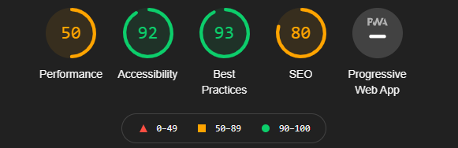

Testing documentation for Gym Rat Fitness
# Contents:
* [Testing User Stories](#testing-user-stories)
* [Bugs: Discovered & Resolved](#bugs:-discovered-&-resolved)
* [Manual Functionality Testing](#manual-functionality-testing)
* [Validation Testing](#validation-testing)
* [Lighthouse Performance](#lighthouse-performance)
* [Cross-browser](#cross-browser)
* [Responsive Testing](#responsive-testing)
* [Known Issues and Bugs](#known-issues-and-bugs)
* [Notes](#notes)

## Testing User Stories
>UST1: **_As a casual unregistered user, I want to be able to:_**
> **Navigate across the site easily**

**How do they arrive at that?**
Site users will be able to navigate the site quickly and easily due to the Implementation of a standard navbar structure and layout. This will help aid the user navigate the site easily. The different areas of interest will be available from the navbar, or a navbar dropdown menu. Users can simply click the option they wish to review and be redirected to their chosen page. Users can also use the search functionality to find products, by clicking on the search button located on the Navbar.
***
>UST2: **Quickly identify any new programs or deals**

**How do they arrive at that?**
New deals will be brought to the users attention using banners. These will be displayed across the site in the same position – directly below the navbar. The chosen banner colour stands out in contrast to the rest of the site, drawing the eye of the user to it. New programs will be displayed on the home page, to find out more, users can simply click on the 'Learn More' button to be redirected to the program details page.
***
> UST3:**Browse the available programs, nutrition plans or merchandise**

**How do they arrive at that?**
Users can browse the available programs, nutrition plans or merchandise by navigating to the navbar and clicking on the nav-item for their selected choice. From there they will be redirected to their page of choice and can browse the products by category.
***
> UST4:**Search for a particular program I’ve heard about**

**How do they arrive at that?**
Users can click on the navbar Search icon or the floating action search option on mobile and tablet to reveal the search bar. From there the user can search for their query and be redirected to search results.
***
> UST5:**View my bag and the items added to it**

**How do they arrive at that?**
To view their bag and the items added to it, users can simply navigate to the navbar and click on the ‘bag icon’ available in the navbar. This will redirect the user to their shopping bag where they can review the item added to it.
***
>UST6: **Add an item to my bag**

**How do they arrive at that?**
To add an item to their bag, users can navigate to the item they wish to purchase using either the navbar or the search option to find the item in question. Once they have done so, they can select their quantity of choice and click the ‘Add to Bag’ button to add the item to their bag. The user will be made aware of this choice/action by a ‘success toast’ which will appear below the shopping bag icon in the navbar, informing them that:

* They have successfully added an item to their bag
* It will display the specific item they have added to their bag
* The price of said item and grand total
***
> UST7:**Edit the quantity of items in my shopping bag**

**How do they arrive at that?**
To edit the quantity of an item added to their shopping bag, users can select the ‘bag icon’ in the navbar to be redirected to their shopping bag. From there users can use the ‘quantity selector’ made available on each item in the bag to either increase or decrease the quantity of the item. To update the quantity, they must click 'Update'. A new total for the item will automatically be calculated as well as the ‘Grand Total’ of the bag.
***
>UST8: **Remove an item from my shopping bag**

**How do they arrive at that?**
To remove an unwanted item from their shopping bag, users can select the ‘bag icon’ in the navbar to be redirected to their shopping bag. Once redirected the user can select the ‘Remove’ button for that item to remove it from their bag. This will automatically update the ‘Grand Total’ of the shopping bag to subtract the price of the deleted item.
***
> UST9:**Make a once-off purchase securely without creating an account**

**How do they arrive at that?**
Users can make a once-off payment securely without creating an account by:
* Choosing the item they wish to purchase
* Selecting the ‘Add to Bag’ button 
* Navigating the to the shopping bag through the success toast or the navbar by clicking the 'Secure Checkout' button. 
* Once redirected to the checkout, the user can supply:
	* Shipping details 
	* Card payment details 
	* Click the ‘Complete Order’ button. 

Provided the transaction is successful, users will be redirected to successful checkout page where they will see:
* A summary of the items purchased
* The shipping and delivery information supplied by the user
* A notification informing of them a pending confirmation email sent to the email address supplied in the shipping and delivery information.
***
>UST10: **Have the option to create an account if I like the content of the site**

**How do they arrive at that?**
If a site user wishes to create an account or sign up to Gym Rat Fitness, they can do so by navigating to the navbar and selecting the ‘Register’ nav-item from the 'My Accounts' dropdown. Once they have been redirected the user will be prompted to provide the following information:

* Full name
* Username
* Email address
* Password – Users will be prompted to provide a password twice to confirm their given password

Once the user has input this information they will be signed up and are prompted to **verify their identity** by navigating to the ‘Verification Email’ sent to the provided email address and clicking on the link provided. Once a user has done this, they will then be redirected to the home page.
***

>UST11: ***As a returning user, I want to be able to:***
> **Easily login of my account**

**How do they arrive at that?**
Once the user has navigated to the site, they can login to their account by selecting ‘Log In’ nav-item from the 'My Accounts' dropdown in the navbar. This will redirect the user to the login page where they can input the following details:
* Username or email address
* Password

Provided the details input by the user are correct they will then be logged into the site and redirected to home page.
***
>UST12: **Easily logout of my account**

**How do they arrive at that?**
To logout of their account, users can navigate to the nav-bar and select 'Log Out' from the 'My Accounts' dropdown, they will be redirected and prompted to confirm their decision to logout. To confirm their choice they must click the ‘Sign Out’ button, which will log them out of their account and redirect them to the Home page.
***
> UST13: **Easily purchase a program, nutrition plan, or merchandise**

**How do they arrive at that?**
To purchase an item, the user can either: 
* Search for the item using the search functionality implemented site wide  
* Use the navbar to navigate to the item in question by category (Programs, Nutrition, & Merchandise). 

Once the item is found, the user can:
* Select the quantity of the item they wish to purchase 
* Click the ‘Add to Bag’ button. 
* Once ready to purchase their items the user can select:
	*  The shopping bag icon from the navbar and once redirected, click on ‘Secure Checkout’. 
	* Or click the 'Secure Checkout' button in the success toast.

**If the user is logged in and has been redirected to the checkout page:**
* A registered users information will be pre-filled for the shipping and delivery information. (Provided they have purchased items previously with Gym Rat Fitness and chose to save their information for future purchases) Next, they will provide the necessary card details for the payment and select ‘Complete Order’. 

* If this is a users first purchase with Gym Rat Fitness, they can fill out the information necessary to make a purchase and can choose whether to save this information for future purchases. Next, they will provide the necessary card details for the payment and select ‘Complete Order’. 

**If the user is not logged in and has been redirected to the checkout page:**
* The user can fill out the shipping and delivery information necessary to make a purchase.
* Next, they will provide the necessary card details for the payment and select ‘Complete Order’.

Regardless of login status and provided the transaction is successful, users will be redirected to successful checkout page where they will see:

* A summary of the items purchased 
* The grand total inclusive of shipping (if applicable)
* The shipping and delivery information supplied by the user
* A notification informing of them a pending confirmation email sent to the email address supplied in the shipping and delivery information.
***
>UST14:  **Save my shipping information**

**How do they arrive at that?**
To save shipping and delivery information a user must first be **registered & logged in**.
Upon purchasing an item the user can select the **'Save  info'** box to save their details on the checkout page of the payment flow/process. Once clicked, and upon successful completion of the payment the users details will be saved. The user can then:
* View their details on their profile page. 
***

> UST15: **Update my shipping information**

To update shipping information a user must be:
* Registered with Gym Rat Fitness
* Logged in to their account at present
* Made a prior purchase with Gym Rat Fitness

To update delivery information, the user can:
* Click on the 'Delivery Info' dropdown
* Update the current information 
* Click the ‘Update’ button 

**Note:**
Users who haven't made a purchase yet can still add delivery information to their profile (provided they have already registered with the site).

***
>UST16: **View my order history**

**How do they arrive at that?**

Users can view their order history from their profile page. To do this, users must be **logged in**. Locate the navbar and select the ‘My Account’ dropdown menu and select the ‘My Profile’ nav-item. Once redirected to their profile page the user, can view their order history from the Order History dropdown on the righthand side.
***
>UST17: **Post updates of my progress or ask a question**

**How do they arrive at that?**
To post an update or, ask a question, users must first be **logged in** to the site. Click the 'Our Community' dropdown in the navbar and click the 'My Community' dropdown option to be redirected to the Community Feed. From there the user can:
* Create their post in the ''Add Post' card
*  Click 'Post' button. 
* The users post will be available on the community feed and also privately on the users profile page.
***
>UST18: **Update one of my posts**

**How do they arrive at that?**
Users can choose to update any of their posts. To do so, the user must be logged in, updating a post can be done from the following places:
* My Community:
	* Post detail page - reached by clicking on the text of the post
	* User Posts - reached by click on the username of the post
* Profile page - reached by the navigation bar

Once redirected any on these pages, the user can select the post they wish to update and click the button ‘Update’. Once redirected the user can update the post as they see fit and click ‘Update’ to save the updated post. The updated version of the post will be available in the following places:
* My Community
* Profile
***
> UST19:**Delete one of my posts**

**How do they arrive at that?**

To delete a post the user must first be logged in, they can then choose to delete any of their posts. A user can only delete their own posts, this can be achieved from the following places:
* My Community:
	* Post detail page - reached by clicking on the text of the post
	* User Posts - reached by click on the username of the post
* Profile page - reached by the navigation bar

Once redirected any on these pages, the user can select the post they wish to delete and click the button ‘Delete’. This will trigger a modal prompting confirmation of this action, the user must confirm this action by clicking 'Delete', the post will have been deleted. 
***
>UST20: **View posts from all users in one place**

**How do they arrive at that?**
To view posts from all users, the user must first be:
* Registered with Gym Rat Fitness
* Logged in to their account at present

A user can view a collection of posts from other app users by navigating to the navbar and selecting the ‘Our Community’ nav-item and then select the ‘My Community’ nav-item. Once redirected, the user will be able to view the community feed. This is made up of recent posts from other users.
***
> UST21: **To view all posts from a particular user**

**How do they arrive at that?**
To view all posts from a particular user, the user must be:
* Registered with Gym Rat Fitness
* Logged in to their account at present

To view all posts from a particular user, they must navigate to the navbar and select the ‘Our Community’ dropdown menu and in the menu select the ‘My Community’ nav-item. Once redirected, the user will be able to view the '	My Community' feed. To view a particular users posts, they can either:
* Click on the users chip at the top of the page to be redirected to the users post feed. 
* Click on the username on any of the said users posts to be redirected to the users post feed.
***
>UST22: **Add a comment to another users post**

**How do they arrive at that?**
To add a comment to another users post, a user must first be **logged in** to comment on a post. To add a comment:
* Navigate to the 'Our Community' navigation dropdown and select the 'My Community' nav-item
* Once redirected, the user can navigate to the post they wish to comment on and click 'Comment' button
* This will redirect the user to post detail page, the user can then add a comment to the post by filling out the form
* Click the 'Post' button
* The page will then reload and the comment will be available underneath the add comment form
***
>UST23: **Read reviews of a program, nutrition plan, or merchandise prior to purchase**

**How do they arrive at that?**
To read to reviews of a program, nutrition plan, or merchandise a user can navigate to product of interest by searching for it using the search functionality or use the navigation to access the product via category. Click on the card for the product and scroll down to read the reviews posted for the product. 
***
>UST24: **Add a review of a  program, nutrition plan, or merchandise**

**How do they arrive at that?**
A user must be **logged in** to add a review of a product. Once logged in:
* Navigate to the product of interest
* Locate the reviews section of the product and click 'Add Review'
* Once redirected to the 'Add Review' form, fill out the form and click 'Add Review' button. 
* Once the review is posted successfully, the user will be redirected to the product page the user has created a review for and the review will be posted in the reviews section of the product detail page.
***

>UST25: **Edit a review of a  program, nutrition plan, or merchandise**

**How do they arrive at that?**
A user must be **logged in** and can **only edit their own reviews**. A review can be edited in two ways:

**Option 1:**
* Navigate to the product of interest
* Locate the review the user wishes to edit  
* Once located click on the 'Edit Review' button
* When redirected to the form, edit the form and click 'Edit Review' button
* Once the edited review is posted successfully, the user will be redirected to the product page the user has created a review for and the review will be posted in the reviews section of the product detail page

**Option 2:**
* Navigate to the profile
* Click on the Reviews dropdown 
* Locate the review the user wishes to edit
* Click 'Edit' button
* Once relocated to the form, make the necessary changes to the review
* Click 'Edit Review' button
* Once the edited review is posted successfully, the user will be redirected to the product page the user has created a review for and the review will be posted in the reviews section of the product detail page
***
>UST26: **Delete a review of a program, nutrition plan, or merchandise**

**How do they arrive at that?**
A user must be **logged in** and can **only delete their own reviews**. A review can be deleted in two ways:

**Option 1:**
* Navigate to the product of interest
* Locate the review the user wishes to edit  
* Once located click on the 'Delete' button
* This will trigger a user confirmation delete modal, where the user must confirm their action by clicking 'Delete'  
* Once deleted, the user will be redirected to the product page and the review will have been deleted from the reviews section of the product detail page

**Option 2:**
* Navigate to the profile
* Click on the Reviews dropdown 
* Locate the review the user wishes to delete
* Click 'Delete' button
* This will trigger a user confirmation delete modal, where the user must confirm their action by clicking 'Delete'  
* Once deleted, the user will be redirected to the product page and the review will have been deleted from the reviews section of the product detail page
***

>UST27: **_As the site owner or admin, I want to be able to:_**
> **Login to the administration panel**

**How do they arrive at that?**

The site owner or admin must be registered as a ‘Superuser’ and have the correct permissions set to access admin panel:
* Set as Primary and Verified

To login into the admin panel, the superuser can navigate to the site and add ‘/admin/’ to the URL and hit enter. Once redirected to the Django administration panel, they will be prompted to provide their Username and password. Upon successful entry the superuser will be redirected to the admin panel.
***
>UST28: **Add a new program or nutrition plan to the site without logging into
> the admin panel**

**How do they arrive at that?**
* To do this the superuser must **login** into the site using the login page providing the login details for the **superuser account**.
* Once logged in the superuser can then navigate to the **My Accounts** nav-item in the navigation and select the **Product Management** dropdown
* Once redirected fill out the form to add the product:
	* Select the category they wish to add a new item to. 
	* Fill out the necessary fields for the product 
	* Click Add Product

Once the form is submitted the product will be uploaded.
***
>UST29:  **Edit/update any program or nutrition plan on the site without
> logging into the admin panel**

**How do they arrive at that?**
To do this the superuser must be **logged in** to the site providing the login details for the **superuser account**. 
* Once logged in the superuser can either: 
	* Select the category the product is stored in from the navigation and locate it from category page. 
	* Or they can search for the product using the search functionality. 
* Once the product has been located the superuser can click the 'Edit’ button on either the category page or in the product details page.
* This will redirect them to the form to edit the specific product.
* Once the superuser edits the pre-filled data, they can then submit the form and the edited product will be uploaded.
***
>UST30: **Delete any program or nutrition plan on the site without logging into
> the admin panel**

**How do they arrive at that?**
To do this the superuser must **login** into the site providing the login details for the **superuser account.**
* Once logged in the superuser can either:
	* Select the category the product is stored in from the navigation and locate it from category page. 
	* Or they can search for the product using the search functionality. 
*  Once the product has been located the superuser can click ‘Delete’. This will trigger a modal prompting confirmation of this action, to which the superuser can confirm by clicking ‘Delete’.
This will then redirect the superuser to the home page the product will have been deleted.
***

## Bugs: Discovered & Resolved
There was very few issues or bugs discovered during the development process. 

### Reapplied migration removed category image
I just recently made changes to my model to include another field for the products model. When I first added the new field I didn't include a default. I tried to fix this and migrate again but I was still getting the same error: django.core.exceptions.ValidationError: ['“” value must be a decimal number.']. I rolled back my migrations to the last migration applied prior to attempting this and deleted the migration and _pycache_ files. I reapplied the changes and migrated again. All seemed fine but when I looked at the deployed site I no longer had access to the products, it was throwing a 500 server error. I thought this may be because I needed to update the data in the postgres database, so I ran dumpdata and loaddata to update the data. However I was still receiving a 500 error on the deployed site and was then was getting errors thrown on the Gitpod preview of the site all the images were throwing a 404 Value error 'The 'image' attribute has no file associated with it', on index and the products page couldn't be accessed. Resolving this issue took time as I searched through the templates but everything checked out. It was searching the admin panel, that I discovered the images has been deleted from the categories. After adding the images to the database this resolved the issue on both the preview and deployed site. 

### Charfield input not appearing on add post form
When building the add post form the the My Community app, an issue was discovered when trying to display the form on my_community.html
While the rest of the form was rendering the description field would not. After rechecking the model and views I began to research the issue.  As I had experimented with using class views in this app to display all posts and user posts in listviews and I was attempting to add the form to a page rendered using a class view. I checked through the Django documentation and Stack Overflow questions and realised that the field was probably not displaying as I had built a get_context_data function. I wasn't passing the form in to the context of the PostListView. After adding the function to the PostListView class, the description input appeared on the form and was functional. 

### Remove item button not working. 
Once all the functionality was implemented to remove an item from the shopping bag, I moved the Javascript from the template into it own JS file stored in a static directory within the bag app and linked it to the template in a extra_js block in the template. However when retesting the functionality again, the button no longer worked. A 403 error was being raised in the terminal, Forbidden (CSRF token missing or incorrect.) This was strange as the CSRF Token was included in the Javascript and the script itself was displaying in the source. I could not find a reason for the functionality not to work, so I settled for adding the javascript back into the template and the functionality return. I am still unclear as to why this didn't work, but decided it was the easiest way to resolve the issue. 

## Manual Functionality Testing
### Navigation Bar:
| Element            | Action       | Expected Result                 | Pass/Fail | Notes                                                             |
|--------------------|--------------|---------------------------------|-----------|-------------------------------------------------------------------|
| Navbar             |              |                                 |           |                                                                   |
| Site Name          | Click        | Redirect to home page           | Pass      |                                                                   |
| Program            | Click/Hover  | Opens Programs Dropdown         | Pass      |                                                                   |
| All Programs       | Click        | Redirect to all programs        | Pass      |                                                                   |
| Nutrition          | Click/Hover  | Opens Nutrition dropdown        | Pass      |                                                                   |
| Nutrition 101      | Click        | Redirect to nutrition plans     | Pass      |                                                                   |
| Our Community      | Click/Hover  | Opens our community dropdown    | Pass      |                                                                   |
| Our Community      | Click        | Redirects to our community      | Pass      |                                                                   |
| My Community       | Click        | Redirects to my community       | Pass      | Dependant on user session status                                  |
| My Account         | Click/Hover  | Opens my account dropdown       | Pass      |                                                                   |
| Product Management | Click        | Redirect product management     | Pass      | Only available to superusers and dependant on user session status |
| My Profile         | Click        | Redirect my profile             | Pass      | Dependant on user session status                                  |
| Log In             | Click        | Redirect to Login               | Pass      | Dependant on user session status                                  |
| Logout             | Click        | Redirect to logout confirmation | Pass      | Dependant on user session status                                  |
| Shopping Bag       | Click        | Redirects to Shopping bag       | Pass      |                                                                   |

### Footer
| Element        | Action | Expected Result        | Pass/Fail | Notes |
|----------------|--------|------------------------|-----------|-------|
| Footer         |        |                        |           |       |
| Site Name      | Click  | Redirects to home      | Pass      |       |
| Socials        |        |                        |           |       |
| Facebook Link  | Click  | Redirects to Facebook  | Pass      |       |
| TikTok Link    | Click  | Redirects to TikTok    | Pass      |       |
| Instagram Link | Click  | Redirects to Instagram | Pass      |       |
| Copyright      | N/A    | N/A                    | N/A       |       |

### Home
| Element          | Action | Expected Result                    | Pass/Fail | Notes          |
|------------------|--------|------------------------------------|-----------|----------------|
| Delivery Banner  | N/A    | N/A                                | N/A       |                |
| Image parallax   | N/A    | N/A                                | N/A       | Image & text |
| Shop program btn | Click  | Redirects to program category      | Pass      |                |
| Learn More btns  | Click  | Redirects to specific program page | Pass      |                |
| Image parallax   | N/A    | N/A                                | N/A       | Image & text   |
| Image parallax   | N/A    | N/A                                | N/A       | Image & text   |
| Shop Merch btn   | Click  | Redirects to merchandise category  | Pass      |                |

### Programs
| Element            | Action | Expected Result                | Pass/Fail | Notes                                                                          |
|--------------------|--------|--------------------------------|-----------|--------------------------------------------------------------------------------|
| Home Link          | Click  | Redirect to home page          | Pass      |                                                                                |
| Filter by dropdown | Click  | Opens filter by options        | Pass      |                                                                                |
| Filter by options  | Click  | Re-orders the products         | Pass      |                                                                                |
| Product cards      | Click  | Redirects to product details   | Pass      |                                                                                |
|                    | Hover  | Box shadow appears             | Pass      |                                                                                |
| Category Link     | Click  | Redirect to category page       | Pass      |                                                                                            |
| Edit btn           | Click  | Redirects to edit product form | Pass      | Only available to superusers                                                   |
| Delete btn         | Click  | Triggers delete modal          | Pass      | Only available to superusers. Must click delete btn in modal to delete product |
| Modal             |        |                                 |           |                                                                                            |
| Delete btn        | Click  | Deletes product                  | Pass      |                                                                                            |
| Cancel btn        | Click  | Closes modal                    | Pass      |                                                                                            |

### Nutrition
| Element            | Action | Expected Result                | Pass/Fail | Notes                                                                          |
|--------------------|--------|--------------------------------|-----------|--------------------------------------------------------------------------------|
| Home Link          | Click  | Redirect to home page          | Pass      |                                                                                |
| Filter by dropdown | Click  | Opens filter by options        | Pass      |                                                                                |
| Filter by options  | Click  | Re-orders the products         | Pass      |                                                                                |
| Product cards      | Click  | Redirects to product details   | Pass      |                                                                                |
|                    | Hover  | Box shadow appears             | Pass      |                                                                                |
| Category Link     | Click  | Redirect to category page       | Pass      |                                                                                            |
| Edit btn           | Click  | Redirects to edit product form | Pass      | Only available to superusers                                                   |
| Delete btn         | Click  | Triggers delete modal          | Pass      | Only available to superusers. Must click delete btn in modal to delete product |
```markdown
| Modal             |        |                                 |           |                                                                                            |
| Delete btn        | Click  | Deletes product                 | Pass      |                                                                                            |
| Cancel btn        | Click  | Closes modal                    | Pass      |                                                                                            |
```
### Merchandise
| Element            | Action | Expected Result                | Pass/Fail | Notes                                                                          |
|--------------------|--------|--------------------------------|-----------|--------------------------------------------------------------------------------|
| Home Link          | Click  | Redirect to home page          | Pass      |                                                                                |
| Filter by dropdown | Click  | Opens filter by options        | Pass      |                                                                                |
| Filter by options  | Click  | Re-orders the products         | Pass      |                                                                                |
| Product cards      | Click  | Redirects to product details   | Pass      |                                                                                |
|                    | Hover  | Box shadow appears             | Pass      |                                                                                |
| Category Link     | Click  | Redirect to category page       | Pass      |                                                                                            |
| Edit btn           | Click  | Redirects to edit product form | Pass      | Only available to superusers                                                   |
| Delete btn         | Click  | Triggers delete modal          | Pass      | Only available to superusers. Must click delete btn in modal to delete product |
| Modal             |        |                                 |           |                                                                                            |
| Delete btn        | Click  | Deletes product                  | Pass      |                                                                                            |
| Cancel btn        | Click  | Closes modal                    | Pass      |                                                                                            |

### Product details
**Note:** It was decided to implement two structures or layouts for product details depending on the category accessed. The layout for the **Programs** and **Nutrition** categories is as follows: 
| Element            | Action | Expected Result                 | Pass/Fail | Notes                                                                                      |
|--------------------|--------|---------------------------------|-----------|--------------------------------------------------------------------------------------------|
| Image parallax     | N/A    | N/A                             | N/A       |                                                                                            |
| Join btn           | Click  | Redirect to join section        | Pass      |                                                                                            |
| Review Cards       |        |                                 |           |                                                                                            |
| Edit btn           | Click  | Redirects to edit review form   | Pass      | Only displayed to the review creator                                                       |
| Delete btn         | Click  | Triggers delete modal           | Pass      | Only displayed to the review creator. User must click delete btn on modal to delete review |
| Modal              |        |                                 |           |                                                                                            |
| Delete btn         | Click  | Deletes review                  | Pass      |                                                                                            |
| Cancel btn         | Click  | Closes modal                    | Pass      |                                                                                            |
| Add Review btn     | Click  | Redirects to add review form    | Pass      | If user is in session                                                                      |
|                    | Click  | Redirects to login page         | Pass      | If user is not in session                                                                  |
| Category Link      | Click  | Redirect to category page       | Pass      |                                                                                            |
| Select quantity    |        |                                 |           |                                                                                            |
| Minus btn          | Click  | Decreases quantity              | Pass      |                                                                                            |
| Plus btn           | Click  | Increases quantity              | Pass      |                                                                                            |
| Keep shopping btn  | Click  | Redirects back to category page | Pass      |                                                                                            |
| Add to bag btn     | Click  | Adds product to bag             | Pass      |                                                                                            |
| Product Management |        |                                 |           |                                                                                            |
| Edit btn           | Click  | Redirects to edit product form  | Pass      |                                                                                            |
| Delete btn         | Click  | Triggers delete product modal   | Pass      |                                                                                            |
| Modal              |        |                                 |           |                                                                                            |
| Delete btn         | Click  | Deletes product                 | Pass      |                                                                                            |
| Cancel             | Click  | Closes modal                    | Pass      |                                                                                            |

#### The layout/structure for the **merchandise** category is as follows:

| Element           | Action | Expected Result                | Pass/Fail | Notes                                                                                      |
|-------------------|--------|--------------------------------|-----------|--------------------------------------------------------------------------------------------|
| Category link     | Click  | Redirects to category page     | Pass      |                                                                                            |
| Reviews link      | Click  | Redirects to reviews section   | Pass      |                                                                                            |
| Select quantity   |        |                                |           |                                                                                            |
| Minus btn         | Click  | Decrements quantity            | Pass      |                                                                                            |
| Plus btn          | Click  | Increments quantity            | Pass      |                                                                                            |
| Keep Shopping btn | Click  | Redirects back to category     | Pass      |                                                                                            |
| Add to bag        | Click  | Adds product to bag            | Pass      |                                                                                            |
| Review Cards      |        |                                |           |                                                                                            |
| Edit btn          | Click  | Redirects to edit review form  | Pass      | Only displayed to the review creator                                                       |
| Delete btn        | Click  | Triggers delete modal          | Pass      | Only displayed to the review creator. User must click delete btn on modal to delete review |
| Modal             |        |                                |           |                                                                                            |
| Delete btn        | Click  | Deletes review                 | Pass      |                                                                                            |
| Cancel btn        | Click  | Closes modal                   | Pass      |                                                                                            |
| Add Review btn    | Click  | Redirects to add review form   | Pass      | If user is in session                                                                      |
|                   | Click  | Redirects to login page        | Pass      | If user is not in session                                                                  |
| Edit btn          | Click  | Redirects to edit product form | Pass      |                                                                                            |
| Delete btn        | Click  | Triggers delete product modal  | Pass      |                                                                                            |
| Modal             |        |                                |           |                                                                                            |
| Delete btn        | Click  | Deletes product                | Pass      |                                                                                            |
| Cancel            | Click  | Closes modal                   | Pass      |                                                                                            |

### Our Community
| Element          | Action | Expected Result         | Pass/Fail |
|------------------|--------|-------------------------|-----------|
| Image parallax   | N/A    | N/A                     | N/A       |
| Shop program btn | Click  | Redirect to program btn | Pass      |
| Register btn     | Click  | Redirects to signup     | Pass      |
| Login            | Click  | Redirects to login      | Pass      |

### My Community: 
Access to my community is dependant on where user is logged in.

| Element          | Action | Expected Result             | Pass/Fail | Notes                    |
|------------------|--------|-----------------------------|-----------|--------------------------|
| User chips       | Click  | Redirects to user posts     | Pass      |                          |
| Add Post card    |        |                             |           |                          |
| Textfield        | Type   | Add text for post           | Pass      |                          |
| Select image btn | Click  | Opens file directory        | Pass      |                          |
| Post btn         | Click  | Submits form                | Pass      |                          |
| Post cards       |        |                             |           |                          |
| Username         | Click  | Redirects to user posts     | Pass      |                          |
| Post content     | Click  | Redirects to post detail    | Pass      |                          |
| Comment btn      | Click  | Redirects to post detail    | Pass      |                          |
| Pagination       |        |                             |           |                          |
| Previous link    | Click  | Redirects to previous page  | Pass      | Displays when necessary  |
| Next link        | Click  | Redirects to following page | Pass      | Displays where necessary |

### User posts
| Element          | Action | Expected Result                        | Pass/Fail | Notes                            |
|------------------|--------|----------------------------------------|-----------|----------------------------------|
| My community btn | Click  | Redirects to user back to my community | Pass      |                                  |
| Post cards       |        |                                        |           |                                  |
| Edit btn         | Click  | Redirects to edit post form          | Pass      | Only available to post creator |
| Delete btn       | Click  | Triggers delete modal                  | Pass      |                                  |
| Modal            |        |                                        |           |                                  |
| Cancel btn       | Click  | Closes modal                           | Pass      |                                  |
| Delete btn       | Click  | Deletes post                           | Pass      |                                  |
| Comment btn      | Click  | Redirects to post detail               | Pass      |                                  |
| Pagination       |        |                                        |           |                                  |
| Previous link    | Click  | Redirects to previous page             | Pass      | Displays when necessary          |
| Next link        | Click  | Redirects to following page            | Pass      | Displays where necessary         |
                        

### Post detail
| Element          | Action | Expected Result                        | Pass/Fail | Notes                            |
|------------------|--------|----------------------------------------|-----------|----------------------------------|
| My community btn | Click  | Redirects to user back to my community | Pass      |                                  |
| Post cards       |        |                                        |           |                                  |
| Edit btn         | Click  | Redirects to edit review form          | Pass      | Only available to review creator |
| Delete btn       | Click  | Triggers delete modal                  | Pass      |                                  |
| Modal            |        |                                        |           |                                  |
| Cancel btn       | Click  | Closes modal                           | Pass      |                                  |
| Delete btn       | Click  | Deletes post                           | Pass      |                                  |
| Comment card     |        |                                        |           |                                  |
| Text field       | Type   | Add text to post                       | Pass      |                                  |
| Post btn         | Click  | Submits comment form                   | Pass      |                                  |
| Pagination       |        |                                        |           |                                  |
| Previous link    | Click  | Redirects to previous page             | Pass      | Displays when necessary          |
| Next link        | Click  | Redirects to following page            | Pass      | Displays where necessary         |

### Profile
| Element                | Action | Expected Result                         | Pass/Fail | Notes                                                         |
|------------------------|--------|-----------------------------------------|-----------|---------------------------------------------------------------|
| Profile card           |        |                                         |           |                                                               |
| Add Info btn           | Click  | Redirect to add profile form            | Pass      | The button shown depends on whether profile                   |
| Update Info btn        | Click  | Redirect to edit profile form           | Pass      | information has been added or not                             |
| Collapsibles x3        | Click  | Slides open to display specified info   | Pass      |                                                               |
| Delivery info form     | Submit | Updates user delivery info              |           | Prepopulated if delivery info has been saved previously       |
| Text input fields      | Type   | Form submit                             | Pass      | No form validation. Fields aren't required.                   |
| Country Dropdown       | Click  | Displays dropdown options               | Pass      |                                                               |
| Update btn             | Click  | Form submitss                           | Pass      |                                                               |
| Order History Dropdown | Click  | Dropdown opens displays previous orders | Pass      |                                                               |
| Order number link      | Click  | Redirects to order history page         | Pass      |                                                               |
| My Reviews Dropdown    | Click  | Displays reviews posted by user         | Pass      |                                                               |
| Review card            |        |                                         |           |                                                               |
| Edit btn               | Click  | Redirects to edit review form           | Pass      |                                                               |
| Delete btn             | Click  | Triggers delete modal                   | Pass      | User must click delete btn in the modal to delete the reviews |
| Modal                  |        | Confirm user action                     | Pass      |                                                               |
| Cancel btn             | Click  | Closes modal                            | Pass      |                                                               |
| Delete btn             | Click  | Deletes review                          | Pass      |                                                               |
| Post cards             |        |                                         |           |                                                               |
| Edit btn               | Click  | Redirects to the edit post form         | Pass      |                                                               |
| Delete btn             | Click  | Triggers delete modal                   | Pass      |                                                               |
| Modal                  |        | Confirm user action                     |           |                                                               |
| Cancel btn             | Click  | Closes modal                            | Pass      |                                                               |
| Delete btn             | Click  | Deletes post                            | True      |                                                               |


### Shopping Bag
| Element               | Action | Expected Result             | Pass/Fail |
|-----------------------|--------|-----------------------------|-----------|
| Collapsible accordian | Click  | Expands to show bag summary | Pass      |
| Secure Checkout btn   | Click  | Redirects to Checkout       | Pass      |
| Update Quantity       |        |                             |           |
| Minus btn             | Click  | Decrements quantity         | Pass      |
| Plus btn              | Click  | Increments quantity         | Pass      |
| Secure Checkout btn   | Click  | Redirects to checkout       | Pass      |

### Checkout
| Element               | Action                          | Expected Result                                                  | Pass/Fail | Notes |
|-----------------------|---------------------------------|------------------------------------------------------------------|-----------|-------|
| Checkout              | Payment                         |                                                                  | Pass      |       |
| Text input fields     |                                 | Prepopulated if default info has been saved already              | Pass      |       |
| If field required     | Filled                          | Will submit form                                                 | Pass      |       |
| If field required     | Blank                           | Won't submit form                                                | Pass      |       |
| If field not required | Filled/Blank                    | Will submit form                                                 | Pass      |       |
| Country dropdown      | Click                           | Opens select dropdown for countries                              | Pass      |       |
| Save-info checkbox    |                                 |                                                                  |           |       |
| Logged in user        | Checked                         | Pre-checked upon page load                                       | Pass      |       |
|                       | Unchecked                       | Unchecked by user, form will submit                              | Pass      |       |
| If anonymous user     |                                 | No checkbox shown                                                | Pass      |       |
| Login link            | Click                           | Redirects to login page                                          | Pass      |       |
| Register link         | Click                           | Redirects to register page                                       | Pass      |       |
| Payment field         |                                 |                                                                  |           |       |
|                       | Invalid card no.                | Error message                                                    | Pass      |       |
|                       | Invalid card exp.               | Error message                                                    | Pass      |       |
|                       | Valid card info                 | Submits form                                                     | Pass      |       |
| Adjust bag btn        | Click                           | Redirects back to shopping bag                                   | Pass      |       |
| Complete Order        |                                 |                                                                  |           |       |
| If form invalid       | Click                           | Form won't submit - error/help text raised on incorrect field    | Pass      |       |
| If form valid         | Payment succeeds                | Loading screen displays and form submits upon successful payment | Pass      |       |
|                       |                                 | Redirects to checkout success                                    |           |       |
|                       | If logged in user               | Order saved to profile                                           | Pass      |       |
| If form valid         | Payment failed                  | Loading screen displays - form does not submit                   | Pass      |       |
|                       |                                 | Error field raised below payment field                           | Pass      |       |
|                       | Payment requires authentication | Loading screen displays, authentication box appears              | Pass      |       |
| Failed auth btn       | Click                           | Authentication box closes, user is directed back to form         | Pass      |       |
|                       |                                 | Error displayed below payment input                              | Pass      |       |
| Complete auth btn     | Click                           | Loading screen displays, - form submits                          | Pass      |       |
|                       |                                 | Redirects to checkout success page                               | Pass      |       |

### Checkout success
| Element  | Action | Expected Result       | Pass/Fail |
|----------|--------|-----------------------|-----------|
| Home btn | Click  | Redirect to home page | Pass      |

### Allauth pages
#### Register
| Element         | Action                                    | Expected Result                                      | Pass/Fail |                                                                           |
|-----------------|-------------------------------------------|------------------------------------------------------|-----------|---------------------------------------------------------------------------|
| Sign in link    | Click                                     | Redirects to sign in page                            | Pass      |                                                                           |
| Sign up form    |                                           |                                                      |           |                                                                           |
| Email field     | Field filled invalid format               | Form does not submit - Error raised on invalid field | Pass      |                                                                           |
|                 | Field filled valid format                 | Form submits                                         | Pass      |                                                                           |
|                 | Email already in use                      | Form does not submit - Error raised on field         | Pass      |                                                                           |
| Username        | Left blank                                | Form does not submit - Error raised on field         | Pass      |                                                                           |
|                 | All whitespace                            | Form does not submit - error raised on field         | Pass      |                                                                           |
|                 | Username in use                           | Form won't submit - error raised on field            | Pass      |                                                                           |
|                 | Valid unused username                     | Form submit                                          | Pass      |                                                                           |
| Password fieldS | Whitespace only                           | Form won't submit - error raised on field            | Pass      |                                                                           |
|                 | Invalid format                            | Form won't submmit - error raised on field           | Pass      |                                                                           |
|                 | Valid format                              | Form won't submit - error raised on field            | Pass      | Form won't submit until the second password field is filled out correctly |
|                 | Valid format doesn't match first password | Form won't submit - error raised on field            | Pass      |                                                                           |
|                 | Valid format passwords match              | Form submits                                         | Pass      |                                                                           |
| Sign Up btn     | Click                                     | Form submits redirect to email verification page     |           | Verification email sent to user                                           |
| Sign Up btn     | Invalid form / Click                      | Form won't submit - error raised on field            | Pass      |                                                                           |

#### Log In/Sign Up
| Element              | Action               | Expected Result                           | Pass/Fail | Notes                                  |
|----------------------|----------------------|-------------------------------------------|-----------|----------------------------------------|
| Sign Up link         | Click                | Redirect to sign up page                  | Pass      |                                        |
| Username             | All whitespace       | Form won't submit - error raised on field | Pass      |                                        |
|                      | Incorrect username   | Form won't submit - error raised on field | Pass      |                                        |
| Password field       | All whitespace       | Form won't submit - error raised on field | Pass      |                                        |
|                      | Wrong password       | Form won't submit - error raised on field | Pass      |                                        |
| Remember Me Checkbox | Click                | Site will remember user                   | Pass      |                                        |
| Home btn             | Click                | Redirect to home page                     | Pass      |                                        |
| Sign In Button       | Valid form - Click   | Form submit - redirect to home page       | Pass      | Success toast for sign in confirmation |
| Sign In btn          | Invalid form - Click | Form won't submit - error raised on field | Pass      |                                        |
| Forgot password link | Click                | Redirect to password reset                | Pass      |                                        |


#### Sign out
| Element    | Action | Expected Result                    | Pass/Fail |
|------------|--------|----------------------------------|-----------|
| Cancel btn | Click  | Redirect to home page            | Pass      |
| Sign out   | Click  | Signs user out and redirect home | Pass      |

#### Password Reset
| Element           | Action          | Expected Result                             | Pass/Fail | Note |
|-------------------|-----------------|---------------------------------------------|-----------|------|
| Email field       | All whitespace  | Form won't submit - error raised on field   | Pass      |      |
|                   | Incorrect email | Form won't submit - error raised on field   | Pass      |      |
|                   | Correct email   | Form won't submit - error raised on field   | Pass      |      |
| Back to login btn | Click           | Redirect to login page                      | Pass      |      |
| Reset my password | Click           | Reset password email sent to email provided | Pass      |      |

### Emails
#### Verification Email
A verification email is sent to the email provided by the user, to verify their identity. The email contains a verification link which redirects the user to the **confirm email page**.  The user then needs to click **confirm**. 

| Element           | Action | Expected Result                 | Pass/Fail | Notes                                                       |
|-------------------|--------|---------------------------------|-----------|-------------------------------------------------------------|
| Verification link | Click  | Redirects to confirm email page | Pass      |                                                             |
| Confirm button    | Click  | Redirect to log in page         | Pass      | Fields will now be prepopulated with the log in information |

#### Password Reset
A password reset email is sent to the email provided by the user. This contains a link to change password page. The user then needs to provide a new password and click **change password**.

| Element             | Action                | Expected Result                           | Pass/Fail |   |
|---------------------|-----------------------|-------------------------------------------|-----------|---|
| Password reset link | Click                 | Redirect to change password page          | Pass      |   |
| Password input      | All whitespace        | Form won't submit - error raised on field | Pass      |   |
|                     | Password not matching | Form won't submit - error raised on field | Pass      |   |
|                     | Passwords match       | Form submit                               | Pass      |   |
| Change password btn | Click                 | Redirect to change password confirmation  | Pass      |   |
| Back to Login       | Click                 | Redirect to login page                    | Pass      |   |

## Forms:

### Product Management
#### Add product form
| Element           | Action     | Expected Result           | Pass/Fail | Notes                   |
|-------------------|------------|---------------------------|-----------|-------------------------|
| Category dropdown | Click      | Show category options     | Pass      |                         |
| Text inputs       | Type       | Add product information   | Pass      | Must be valid to submit |
| Number field      | Click/Type | Increment/decrement value | Pass      | Must be valid to submit |
| Image URL field   | Type       | Provide image url         | Pass      | Must Be valid to submit |
| Image btn         | Click      | Opens file directory      | Pass      |                         |
| Cancel btn        | Click      | Redirects to home page    | Pass      |                         |
| Add Product btn   | Click      | Submits add product form  | Pass      |                         
|

#### Edit product form
| Element           | Action     | Expected Result           | Pass/Fail | Notes                   |
|-------------------|------------|---------------------------|-----------|-------------------------|
| Edit form         | Edit       | Pre populated fields      | Pass      |                         |
| Category dropdown | Click      | Shows category option     | Pass      |                         |
| Text inputs       | Type       | Add product information   | Pass      | Must be valid to submit |
| Number field      | Click/Type | Increment/decrement value | Pass      | Must be valid to submit |
| Image URL field   | Type       | Provide image url         | Pass      | Must Be valid to submit |
| Image btn         | Click      | Opens file directory      | Pass      |                         |
| Cancel btn        | Click      | Redirects to home page    | Pass      |                         |
| Add Product btn   | Click      | Submits add product form  | Pass      |                         |

## Review Forms
#### Add Review
| Element         | Action     | Expected Result                  | Pass/Fail | Notes                   |
|-----------------|------------|----------------------------------|-----------|-------------------------|
| Text inputs     | Type       | Add review title and description | Pass      | Must be valid to submit |
| Rating field    | Click/Type | Increment/decrement value        | Pass      | Must be valid to submit |
| Cancel btn      | Click      | Redirects to home page           | Pass      |                         |
| Add review btn | Click      | Submits add review form         | Pass      |                         |

### Edit Review
| Element          | Action     | Expected Result                  | Pass/Fail | Notes                   |
|------------------|------------|----------------------------------|-----------|-------------------------|
| Edit review form | Edit       | Prepopulated fields              | Pass      |                         |
| Text inputs      | Type       | Add review title and description | Pass      | Must be valid to submit |
| Rating field     | Click/Type | Increment/decrement value        | Pass      | Must be valid to submit |
| Cancel btn       | Click      | Redirects to home page           | Pass      |                         |
| Add Review btn   | Click      | Submits edit form                | Pass      |                         |

## Community forms

### Add post form
| Element          | Action | Expected Result       | Pass/Fail | Notes                   |
|------------------|--------|-----------------------|-----------|-------------------------|
| Text field input | Type   | Add post description  | Pass      | Must be valid to submit |
| Select image btn | Click  | Opens file directory  | Pass      |                         |
| Add post btn     | Click  | Submits add post form | Pass      |                         |

### Edit post form
| Element          | Action | Expected Result        | Pass/Fail | Notes                   |
|------------------|--------|------------------------|-----------|-------------------------|
| Edit form        | Edit   | Prepopulated fields    | Pass      |                         |
| Text field input | Type   | Add post description   | Pass      | Must be valid to submit |
| Select image btn | Click  | Opens file directory   | Pass      |                         |
| Checkbox         | Click  | Removes current image  | Pass      |                         |
| Edit btn         | Click  | Submits edit post form | Pass      |                         |

### Add Comment form
| Element          | Action | Expected Result         | Pass/Fail | Notes                   |
|------------------|--------|-------------------------|-----------|-------------------------|
| Text field input | Type   | Add comment description | Pass      | Must be valid to submit |
| Post btn         | Click  | Submits comment form    | Pass      |                         |


## Validation Testing 
## HTML
The HTML5 for this site was tested and validated using [W3C Markup Validation Service](https://validator.w3.org/). Due to the Django templating used throughout, the site was tested by coping the page source of the live site and running it through the validator. Certain pages were ran through multiple times as they can render differently depending on, for example, the status of the user.

There was two flagged issues that I couldn't resolve an unclosed div on  the add review form. I searched all templates, views and form files but could not find the the unclosed. The functionality for the form works fine and is submitting without an issue. 

There was also a duplicate attribute id_image flagged related to custom clearable file input and the form. This issue was flagged in all apps using the clearable file input.  Again I searched through the templates, form and views but could not find where this attribute was located. I suspect it was label generated in the forms.py file but I could not clear the error. However the clearable form input and form functions. Because of time restraints I could not investigate further.

## CSS
The css files for this site were tested and validated using [W3C CSS Markup Validation Service](https://jigsaw.w3.org/css-validator/).  The CSS returned free of errors. Following this, the CSS was then parsed and had vendor prefixes added using [Autoprefixer CSS Online](https://autoprefixer.github.io/).
INSERT IMG OF CSS VALIDATION

## JavaScript
The script files for this project were validated using [JSHint](https://jshint.com/).  The file was flagged for missing semicolons, however once this was rectified there was no errors in the script.js file. 

## Python
The views.py files were validated using [PEP8 Online](http://pep8online.com/). The only errors flagged were due to either 'continuation line with the same indent as next logical line' or continuation line over/under indented for visual indent.' Once the changes were made the code passed all checks.


## Lighthouse Performance
Coming to the end of the development stage for the project, a lighthouse report was generated using [Chrome Dev Tools](https://developers.google.com/web/tools/lighthouse). The final score for lighthouse were ok. The performance was particularly poor due to the parallax used across the site. But Accessibility, Best Practices, and SEO tested much better. 




## Cross-browser
To test for cross-browser compatibility, the site was tested using [PowerMapper](https://www.powermapper.com/). Cross-browser compatibility tested well. 

The only issue flagged here was:
"The `display: flex` CSS property (that was added to the body element) does not work correctly in some browsers" and indicated that this would be an issue with Internet Explorer 11.

To verify this issue, I consulted [Browserling](https://www.browserling.com/). While the `display: flex` did not seem to cause an issue


## Responsive Testing
The site's responsiveness was testing on the following devices in person:

**Mobile:**
* Huawei P30 Pro
	* Google Chrome
	* Huawei Browser
* Samsung 
	* Google Chrome
	* Samsung Internet

**Tablet:**
* HP Envy x360 - Tablet mode (portrait & landscape)

**Desktop:**
* HP Envy x360
	* Google Chrome
	* Microsoft Edge
	* Mozilla Firefox
	* Opera 

**Chrome Dev Tools:**
Was employed to view the site on a larger variety viewports. 

**Responsinator:**
Was employed where a device or browser wasn't accessible.

## Known Issues and Bugs
* Open div error flagged in the HTML validator. 
* Duplicate ID attribute.


